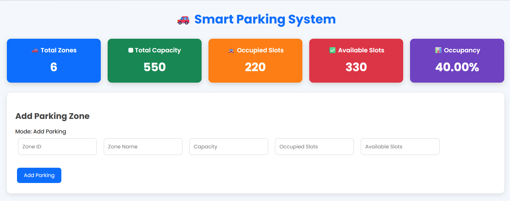
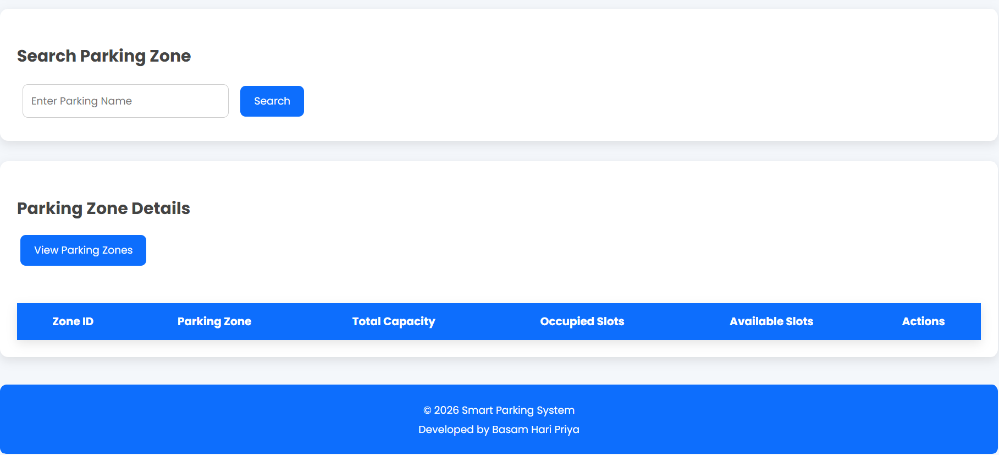
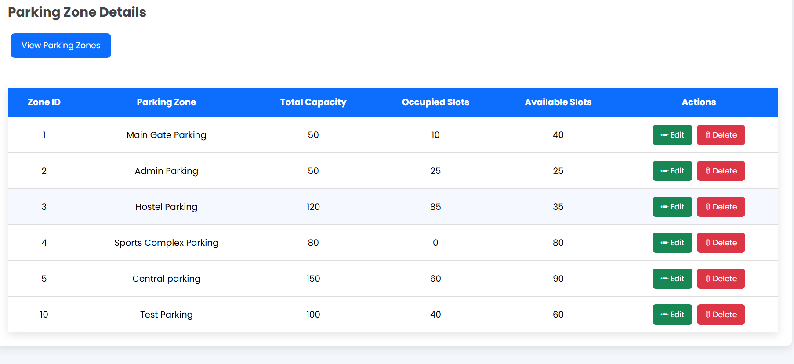
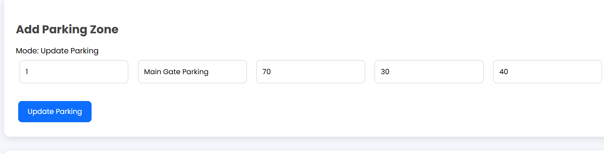
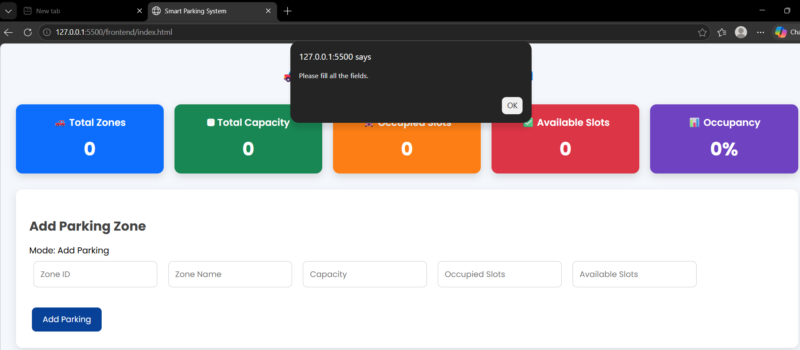
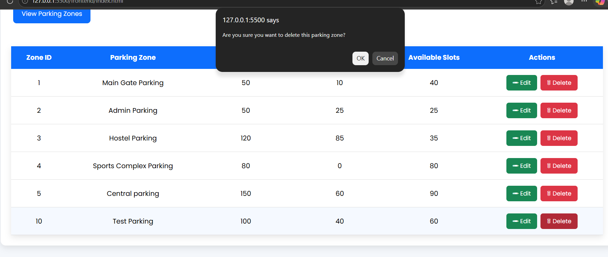
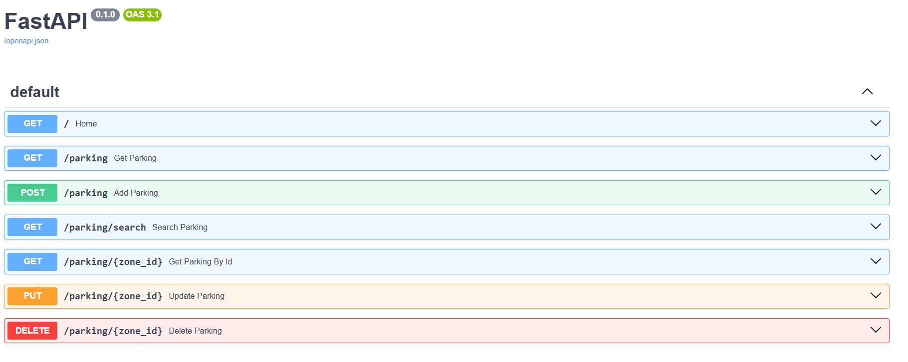

# 🚗 Smart Parking System

## 📌 Project Overview
The Smart Parking System is a full-stack web application developed to simplify parking zone management. It enables administrators to add, view, search, update, and delete parking zones while displaying real-time parking statistics through an interactive dashboard.

The project was built using FastAPI for the backend, PostgreSQL as the database, and HTML, CSS, and JavaScript for the frontend.

It demonstrates CRUD operations, REST APIs, database integration, dashboard analytics, and frontend-backend communication using the Fetch API.

---

## ✨ Features

- Add new parking zones
- View all parking zones
- Search parking zone by name
- Update parking information
- Delete parking zones
- Dashboard with real-time statistics
- Occupancy percentage calculation
- Form validation
- Responsive user interface
- REST API integration using FastAPI

## 🛠️ Technology Stack

### Frontend
- HTML5
- CSS3
- JavaScript (ES6)
- Fetch API

### Backend
- Python
- FastAPI
- Uvicorn
- Pydantic

### Database
- PostgreSQL
- psycopg2

### Development Tools
- Visual Studio Code
- Git
- GitHub
---
## 🏗️ Project Architecture
Frontend (HTML, CSS, JavaScript)
              │
              ▼
      FastAPI Backend
              │
              ▼
     PostgreSQL Database
```
---
## 📂 Project Structure

Smart-Parking-System
│
├── backend
│   ├── database.py
│   ├── main.py
│   ├── models.py
│   ├── routes.py
│   └── requirements.txt
│
├── frontend
│   ├── index.html
│   ├── style.css
│   └── script.js
│
├── .gitignore
└── README.md

---

## 🗄️ Database Schema

### Parking Table

| Column | Data Type | Description |
|--------|-----------|-------------|
| zone_id | Integer | Unique parking zone ID |
| zone_name | String | Parking zone name |
| capacity | Integer | Total parking capacity |
| occupied_slots | Integer | Number of occupied slots |
| available_slots | Integer | Number of available slots |

---

## 🌐 REST API Endpoints

| Method | Endpoint | Description |
|--------|----------|-------------|
| GET | `/` | Welcome message |
| GET | `/parking` | Retrieve all parking zones |
| GET | `/parking/{zone_id}` | Retrieve parking zone by ID |
| GET | `/parking/search?name=` | Search parking zone by name |
| POST | `/parking` | Add a new parking zone |
| PUT | `/parking/{zone_id}` | Update an existing parking zone |
| DELETE | `/parking/{zone_id}` | Delete a parking zone |

---

## ⚙️ Installation Guide

### 1. Clone the repository

```bash
git clone <repository-url>
```

### 2. Navigate to the project

```bash
cd Smart-Parking-System
```

### 3. Install dependencies

```bash
pip install -r backend/requirements.txt
```

### 4. Start the FastAPI server

```bash
cd backend

uvicorn main:app --reload
```

### 5. Open the frontend

Open `frontend/index.html` using Live Server in Visual Studio Code.

---

## 🚀 Future Enhancements

- User Dashboard
- Google Maps Integration
- Nearby Parking Detection
- Geolocation Support
- Parking Logs
- QR Code Based Entry and Exit
- Slot Reservation
- Email Notifications
- Real-time Parking Availability
- AI-Based Vehicle Detection (Future Version)

---

## 📸 Screenshots

### Dashboard Overview



### Search & Parking Table



### Parking Table



### Update Parking



### Validation



### Delete Confirmation



### FastAPI Swagger API Documentation



---

## 👩‍💻 Author

**Hari Priya Basam**

B.Tech Computer Science and Engineering

Parul University

Project developed as part of a Full Stack Development learning journey using FastAPI, PostgreSQL, HTML, CSS, and JavaScript.